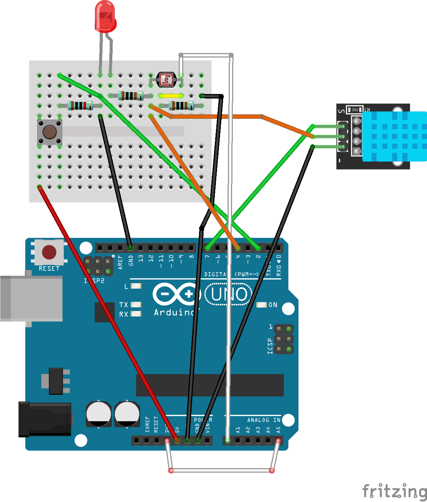
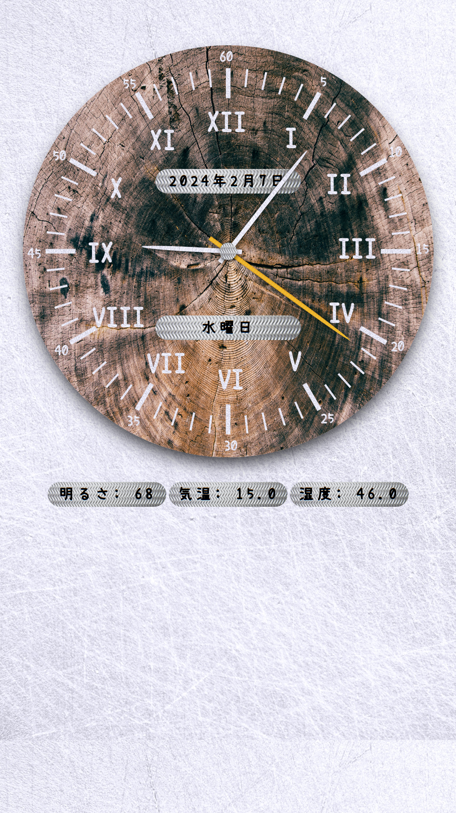

The Good-shaped Clock (gsclock; ja: 良い感じの時計) is a virtual analog clock with Arduino's sensor data for Linux desktop!

Requirements
============
* Ubuntu 22.04
* [ELEGOO's UNO R3 Most Complete Starter Kit](https://www.elegoo.com/en-jp/products/elegoo-uno-most-complete-starter-kit)（ja: [最終版スタータキット](https://www.amazon.co.jp/dp/B06Y56JV64)）
  * Arduino-compatible Elegoo UNO R3
  * Mini Size Breadboard
  * Photoresistor (for illuminance meter)
  * DHT11 Temperature and Humidity Module (for thermometer and hygrometer)
  * IR Reciever Module (for learning IR remote control codes of the lighting equipment)
  * Passive Buzzer (for the notification sound)
  * Potentiometer (for the volume of the Passive Buzzer)
  * Red LED (for the power lamp)
  * Green LED (for the IR reciever lamp)
  * Button x2 (for Power switch and IR Reciever switch)
  * 10kΩ resister x2 (for Button x2) 
  * 1kΩ resister x3 (for LED x2 and Photoresistor)
  * 10Ω resister (for a series of IR LED x3)
  * many jumper wires
* Half+ Size BreadBoard [BB-801](https://akizukidenshi.com/catalog/g/g105294/)
* IR LED [OSI5LA5A33A-B](https://akizukidenshi.com/catalog/g/g113204/) x3 (for control of the brightness of lighting equipment; not implemented yet)

Installation
============
1. Install the following packages via apt:
* psmisc, the small utilities for processes
* chromium-chromedriver, the browser-based application environment
* gcc-avr and avr-libc, the [cross compiler](https://en.wikipedia.org/wiki/Cross_compiler) for Arduino MPU
* arduino-core-avr, the core library for Arduino
* avrdude, the uploading utility for Arduino
```bash
sudo apt install psmisc chromium-chromedriver gcc-avr avr-libc arduino-core-avr avrdude
```

2. Setup your Arduino Uno R3 like this (XXX: not safety-verified yet):


3. Install the main script of gsclock and its dependencies via pip! The build also starts automatically!
```bash
pip install git+https://github.com/nazodane/gsclock.git
```

4a. Upload the arduino program to the your Arduino Uno R3 via avrdude
```bash
avrdude -c arduino -p atmega328p -b 115200 -P /dev/ttyACM0 -U flash:w:~/.local/share/gsclock/gsclock_arduino.hex
```

4b. Install and Launch the Arduino IDE, open ~/.local/share/gsclock/gsclock_arduino.ino, and upload the Arduino program to your Arduino Uno R3 via the Arduino IDE.


Usage
=====
```bash
~/.local/bin/gsclock
```

License
=======
The Good-shaped Clock is mainly under BSD-3-Clause License. The arduino part is under Apache-2.0 license. The images are under CC-0 license and the font is under SIL Open Font License.

For more details, see [LICENSE](LICENSE) file.

Screenshot
==========


Donations
=========
My Amazon wishlist: https://www.amazon.co.jp/hz/wishlist/ls/CCPOV7C6JTD2

Motivations
===========
I've just come to realize the importance of using an analog clock, which I had completely overlooked. Additionally, I've realized the necessity of keeping track of the current year more frequently as a means to prevent my health issues.

I attempted to find a physical analog clock that also displayed the year but my search was unsuccessful. I then looked into virtual clocks for Linux, but unfortunately, they didn't meet my requirements at all.

Finally, I turned to web analog clocks and found that they were the perfect solution. I recreated one to suit all of my needs.
