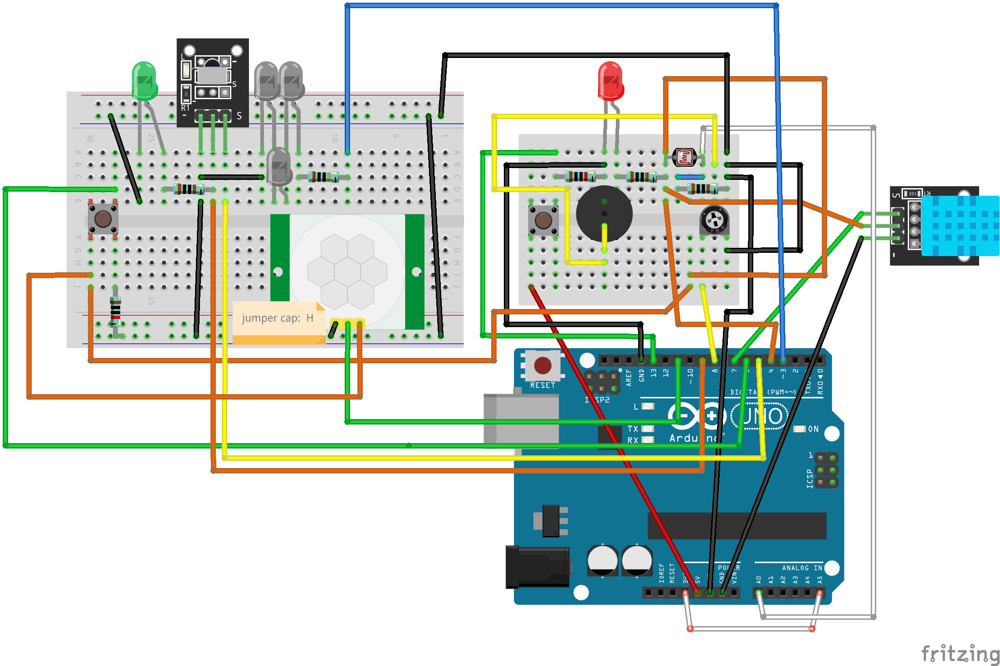

The Good-shaped Clock (gsclock; ja: 良い感じの時計) is a virtual analog clock with Arduino's sensor data for Linux desktop!

Requirements
============
* Ubuntu 22.04
* [ELEGOO's UNO R3 Most Complete Starter Kit](https://www.elegoo.com/en-jp/products/elegoo-uno-most-complete-starter-kit)（ja: [最終版スタータキット](https://www.amazon.co.jp/dp/B06Y56JV64)）
  * Arduino UNO R3
  * Breadboard
  * Photoresistor
  * DHT11
  * 10kΩ register
  * 1kΩ register x2
  * Red LED
  * Button
  * many jumper wires

Installation
============
1. Setup your Arduino Uno R3 like this (XXX: not safety-verified):


2. Download and install the Arduino IDE from [the official site](https://www.arduino.cc/en/software).

3. Open the '''Arduino IDE'''.

4. Download ''[gsclock_arduino/gsclock_arduino.ino](https://raw.githubusercontent.com/nazodane/gsclock/main/gsclock_arduino/gsclock_arduino.ino)'', the source code for arduino (a.k.a. sketch).

5. Open the sketch in Arduino IDE and then upload the sketch to arduino device via Arduino IDE.

6. Install chromium-chromedriver, the browser-based application environment, via apt.
```bash
sudo apt install chromium-chromedriver
```

7. Install the main script of gsclock and its dependencies via pip!
```bash
pip install git+https://github.com/nazodane/gsclock.git
```

Usage
=====
```bash
~/.local/bin/gsclock
```

License
=======
The Good-shaped Clock is mainly under BSD-3-Clause License. The arduino part is under Apache-2.0 license. The images are under CC-0 license and the font is under SIL Open Font License.

For more details, see [LICENSE](LICENSE) file.

Screenshot
==========


Donations
=========
My Amazon wishlist: https://www.amazon.co.jp/hz/wishlist/ls/CCPOV7C6JTD2

Motivations
===========
I've just come to realize the importance of using an analog clock, which I had completely overlooked. Additionally, I've realized the necessity of keeping track of the current year more frequently as a means to prevent my health issues.

I attempted to find a physical analog clock that also displayed the year but my search was unsuccessful. I then looked into virtual clocks for Linux, but unfortunately, they didn't meet my requirements at all.

Finally, I turned to web analog clocks and found that they were the perfect solution. I recreated one to suit all of my needs.
